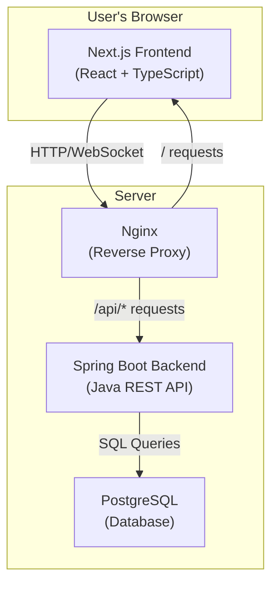
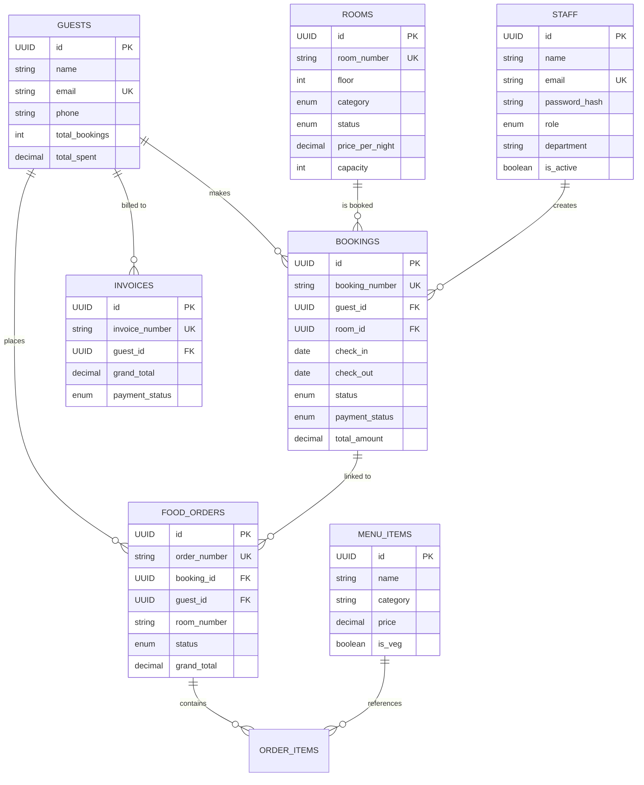
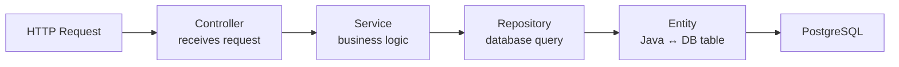
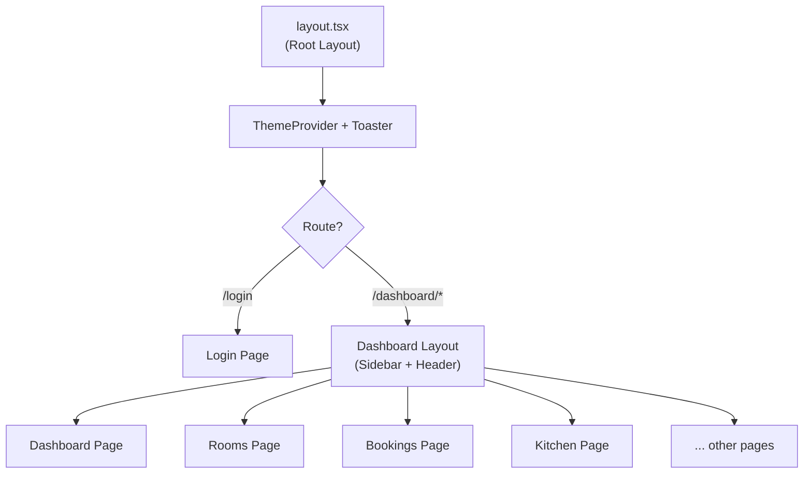
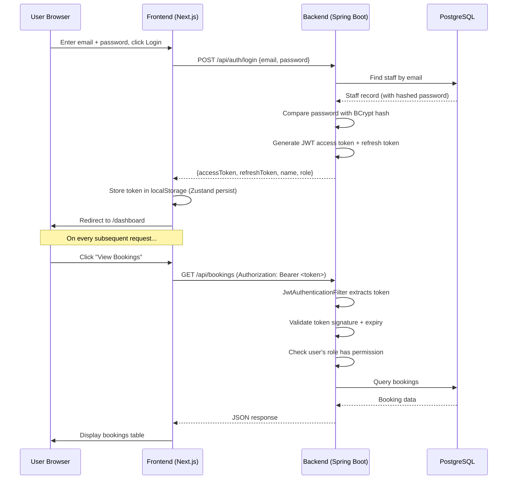
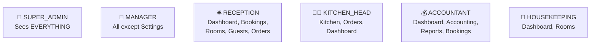
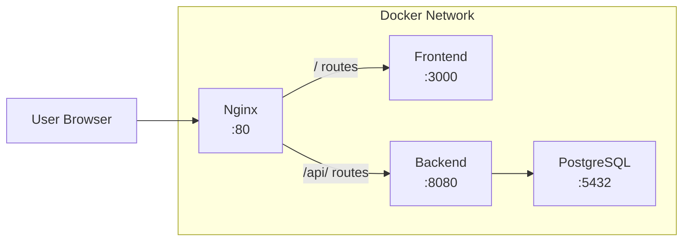

# 🏨 Village Trails Resort CRM — Complete Project Documentation

> **What is this project?** A full-stack web application to manage a resort's daily operations — bookings, rooms, kitchen orders, guests, staff, and accounting. Think of it as the "brain" of a resort.

---

## 📋 Table of Contents
1. [Big Picture Overview](#1-big-picture)
2. [Tech Stack Explained](#2-tech-stack)
3. [Project Folder Structure](#3-folder-structure)
4. [Database Design](#4-database)
5. [Backend (Spring Boot) Explained](#5-backend)
6. [Frontend (Next.js) Explained](#6-frontend)
7. [Authentication Flow](#7-auth-flow)
8. [How Frontend Talks to Backend](#8-api-communication)
9. [Role-Based Access Control](#9-rbac)
10. [Docker & Deployment](#10-docker)
11. [How to Run the Project](#11-how-to-run)

---

## 1. Big Picture Overview {#1-big-picture}



**How it works in simple terms:**
1. **User opens browser** → sees the Next.js frontend (React pages)
2. **User clicks something** (e.g., "View Bookings") → frontend sends HTTP request to backend
3. **Backend receives request** → checks if user is authorized → queries the database → sends back JSON data
4. **Frontend receives data** → displays it in beautiful UI components

---

## 2. Tech Stack Explained {#2-tech-stack}

### Frontend (What the user sees)
| Technology | What it does | Analogy |
|---|---|---|
| **Next.js 15** | React framework that handles routing, pages | The "skeleton" of the website |
| **TypeScript** | JavaScript with type safety | Spell-checker for code |
| **Tailwind CSS** | Utility classes for styling | Pre-made design blocks |
| **Zustand** | State management (stores user login info) | App's "memory" |
| **Framer Motion** | Smooth animations | Makes things slide/fade nicely |
| **Radix UI** | Pre-built accessible components (dropdowns, dialogs) | Ready-made UI parts |
| **Recharts** | Charts and graphs | Draws bar charts, line charts |
| **Axios** | Makes HTTP requests to backend | The "messenger" to server |
| **Lucide React** | Icon library | All the small icons you see |

### Backend (Server logic)
| Technology | What it does | Analogy |
|---|---|---|
| **Spring Boot 3.2** | Java web framework | The "brain" that processes requests |
| **Java 21** | Programming language | The language the brain speaks |
| **Spring Security** | Authentication & authorization | The "security guard" |
| **JWT (JSON Web Tokens)** | Login tokens | Your "entry pass" after login |
| **Spring Data JPA** | Database access layer | Translator between Java and SQL |
| **WebSocket (STOMP)** | Real-time communication | Live kitchen order updates |
| **Lombok** | Reduces boilerplate code | Auto-writes getters/setters |
| **PostgreSQL 16** | Relational database | Where all data is stored |

### Infrastructure
| Technology | What it does |
|---|---|
| **Docker** | Packages each service into containers |
| **Docker Compose** | Runs all containers together |
| **Nginx** | Routes traffic to frontend or backend |

---

## 3. Project Folder Structure {#3-folder-structure}

```
CRM-testout1/
├── 📁 frontend/                    ← NEXT.JS APP (what users see)
│   ├── src/
│   │   ├── 📁 app/                 ← PAGES (each folder = a URL route)
│   │   │   ├── (auth)/login/       ← /login page
│   │   │   ├── (dashboard)/        ← All dashboard pages
│   │   │   │   ├── dashboard/      ← /dashboard (main overview)
│   │   │   │   ├── rooms/          ← /rooms
│   │   │   │   ├── bookings/       ← /bookings
│   │   │   │   ├── kitchen/        ← /kitchen
│   │   │   │   ├── orders/         ← /orders
│   │   │   │   ├── guests/         ← /guests
│   │   │   │   ├── staff/          ← /staff
│   │   │   │   ├── accounting/     ← /accounting
│   │   │   │   ├── reports/        ← /reports
│   │   │   │   └── settings/       ← /settings
│   │   │   ├── layout.tsx          ← Root layout (wraps everything)
│   │   │   └── globals.css         ← Global styles
│   │   ├── 📁 components/          ← REUSABLE UI PIECES
│   │   │   ├── dashboard/          ← StatsCard, Charts, ActivityFeed
│   │   │   ├── features/           ← RoomGrid, BookingTable, OrderBoard
│   │   │   ├── layout/             ← Sidebar, Header, ThemeProvider
│   │   │   ├── modals/             ← Popup forms (NewBooking, AddStaff)
│   │   │   └── ui/                 ← Base components (Button, Card, Input...)
│   │   ├── 📁 data/                ← Mock/fake data for development
│   │   ├── 📁 lib/                 ← Utilities & API client
│   │   ├── 📁 store/               ← Zustand state stores
│   │   └── 📁 types/               ← TypeScript type definitions
│   └── package.json
│
├── 📁 backend/                     ← SPRING BOOT API (server logic)
│   ├── src/main/java/com/villagetrails/crm/
│   │   ├── CrmApplication.java     ← Entry point (starts the server)
│   │   ├── 📁 config/              ← Security & WebSocket setup
│   │   ├── 📁 controller/          ← API endpoints (receives HTTP requests)
│   │   ├── 📁 service/             ← Business logic (the "thinking" part)
│   │   ├── 📁 repository/          ← Database queries
│   │   ├── 📁 entity/              ← Java classes = database tables
│   │   ├── 📁 dto/                 ← Data Transfer Objects (request/response shapes)
│   │   ├── 📁 security/            ← JWT token handling
│   │   └── 📁 exception/           ← Error handling
│   ├── src/main/resources/
│   │   └── application.properties  ← App configuration
│   └── pom.xml                     ← Java dependencies
│
├── 📁 database/
│   ├── schema.sql                  ← Creates all tables
│   └── seed.sql                    ← Inserts sample data
│
├── 📁 nginx/
│   └── nginx.conf                  ← Reverse proxy configuration
│
├── docker-compose.yml              ← Defines all services
└── .env.example                    ← Environment variables template
```

---

## 4. Database Design {#4-database}

### Entity Relationship Diagram



### Tables Explained

| Table | Purpose | Key Columns |
|---|---|---|
| `staff` | Resort employees who log in | name, email, role, department |
| `guests` | Customers who stay | name, email, phone, total_spent |
| `rooms` | Physical rooms in resort | room_number, category, status, price |
| `bookings` | Room reservations | guest→room link, dates, amounts |
| `food_orders` | Kitchen orders | linked to booking+guest, status tracking |
| `menu_items` | Food menu | name, price, veg/non-veg |
| `invoices` | Bills generated | linked to guest, GST calculations |
| `audit_logs` | Who did what when | staff action tracking |

### Important Enums (Status Values)
- **Room Status**: `AVAILABLE` → `OCCUPIED` → `CLEANING` → `AVAILABLE`
- **Booking Status**: `PENDING` → `CONFIRMED` → `CHECKED_IN` → `CHECKED_OUT`
- **Order Status**: `PENDING` → `ACCEPTED` → `PREPARING` → `READY` → `DELIVERED`
- **Payment Status**: `PENDING` → `PARTIAL` → `PAID`
- **Staff Roles**: `SUPER_ADMIN`, `MANAGER`, `RECEPTION`, `KITCHEN_HEAD`, `ACCOUNTANT`, `HOUSEKEEPING`

---

## 5. Backend (Spring Boot) — Explained {#5-backend}

### How Backend Code is Organized (Layered Architecture)



**Think of it like a restaurant:**
- **Controller** = Waiter (takes your order)
- **Service** = Chef (processes the order)  
- **Repository** = Pantry (fetches ingredients/data)
- **Entity** = Recipe card (maps to database table)

### Controllers (API Endpoints)

Each controller handles HTTP requests for one area:

| File | URL Prefix | What it does |
|---|---|---|
| `AuthController` | `/api/auth/` | Login, logout, refresh tokens |
| `DashboardController` | `/api/dashboard/` | Get live stats (revenue, occupancy) |
| `BookingController` | `/api/bookings/` | CRUD bookings, check-in/out |
| `RoomController` | `/api/rooms/` | List rooms, update status |
| `FoodOrderController` | `/api/orders/` | Place orders, update kitchen status |
| `GuestController` | `/api/guests/` | Manage guest records |
| `StaffController` | `/api/staff/` | Manage staff (admin only) |

### API Endpoints Detail

```
POST /api/auth/login          → Send email+password, get JWT token back
POST /api/auth/refresh        → Send refresh token, get new access token

GET  /api/dashboard/stats     → Returns: revenue, occupancy %, bookings count, etc.

GET  /api/rooms               → List all rooms (filter by status/category)
GET  /api/rooms/{id}          → Get one room's details
PATCH /api/rooms/{id}/status  → Change room status (e.g., AVAILABLE→CLEANING)

GET  /api/bookings            → List bookings (paginated, searchable)
POST /api/bookings            → Create new booking
POST /api/bookings/{id}/check-in   → Mark guest as checked in
POST /api/bookings/{id}/check-out  → Mark guest as checked out
POST /api/bookings/{id}/cancel     → Cancel a booking

GET  /api/orders              → List kitchen orders
POST /api/orders              → Place new food order
PATCH /api/orders/{id}/status → Move order: PENDING→ACCEPTED→PREPARING→READY→DELIVERED

GET  /api/guests              → List guests (paginated, searchable)
GET  /api/staff               → List staff members
```

### Services (Business Logic)

| Service | Key Methods | What They Do |
|---|---|---|
| `AuthService` | `login()`, `refresh()` | Validates credentials, generates JWT tokens |
| `BookingService` | `checkIn()`, `checkOut()`, `cancel()` | Changes booking status with validation |
| `RoomService` | `updateStatus()`, `save()` | Updates room availability, prevents duplicate room numbers |
| `FoodOrderService` | `place()`, `updateStatus()` | Places orders + sends WebSocket notification to kitchen |

### Entities (Database Table ↔ Java Class)

Each entity class maps to a database table. Example:

```java
// Room.java → maps to "rooms" table
@Entity
@Table(name = "rooms")
public class Room extends BaseEntity {
    private String roomNumber;      // → room_number column
    private RoomCategory category;  // → category column (ENUM)
    private RoomStatus status;      // → status column (ENUM)
    private BigDecimal pricePerNight; // → price_per_night column
    private List<String> amenities; // → room_amenities join table
}
```

**BaseEntity** — every entity inherits `id` (UUID), `createdAt`, `updatedAt`.

---

## 6. Frontend (Next.js) — Explained {#6-frontend}

### How the Frontend is Organized



### Key Frontend Files Explained

#### 1. `app/layout.tsx` — Root Layout
- Wraps the **entire** app
- Loads Google Fonts (Inter, Playfair Display)
- Adds `ThemeProvider` (dark/light mode support)
- Adds `Toaster` (popup notifications like "Booking created!")

#### 2. `app/(auth)/login/page.tsx` — Login Page
- Split-screen design: left = branding, right = login form
- Has demo credential buttons for quick testing
- On submit → calls `authStore.login()` → stores token → redirects to `/dashboard`

#### 3. `app/(dashboard)/layout.tsx` — Dashboard Layout
- **Auth Guard**: checks if user is logged in, redirects to `/login` if not
- Renders: `Sidebar` (left) + `Header` (top) + page content (center)

#### 4. `app/(dashboard)/dashboard/page.tsx` — Main Dashboard
- Shows 8 stat cards (revenue, occupancy, bookings, orders)
- Recent bookings list
- Occupancy donut chart
- Revenue line chart
- Activity feed (audit logs)
- Currently uses **mock data** (not connected to backend yet)

### State Management (Zustand Stores)

#### `authStore.ts` — Authentication State
```
What it stores: user info, JWT token, isAuthenticated flag
Key methods:
  login(email, password)  → validates against mock users → stores token
  logout()                → clears everything
  hasRole(...roles)       → checks if user has specific role
  canAccess(module)       → checks if user can see a module
```

> ⚠️ **Currently uses mock data!** The `login()` method checks against hardcoded users in `mockData.ts` instead of calling the real backend API.

#### `uiStore.ts` — UI State
```
What it stores: sidebar collapsed state, notifications, theme
Key methods:
  toggleSidebar()          → collapse/expand sidebar
  markNotificationRead()   → mark one notification as read
  addNotification()        → add new notification
```

### Component Categories

#### Dashboard Components (`components/dashboard/`)
| Component | What it renders |
|---|---|
| `StatsCard` | Single KPI card (e.g., "Total Revenue: ₹12,34,000") with trend arrow |
| `RevenueChart` | SVG line chart showing monthly revenue |
| `OccupancyChart` | SVG donut chart showing room occupancy breakdown |
| `ActivityFeed` | List of recent actions (who did what, when) |

#### Feature Components (`components/features/`)
| Component | What it renders |
|---|---|
| `RoomGrid` | Grid of room cards with status colors |
| `BookingTable` | Table of bookings with status badges |
| `OrderBoard` | Kanban-style board: Pending → Accepted → Preparing → Ready → Delivered |
| `InvoiceTable` | Table of invoices with payment status |

#### Layout Components (`components/layout/`)
| Component | What it renders |
|---|---|
| `Sidebar` | Left navigation with role-based menu items |
| `Header` | Top bar with search, notifications, user dropdown, theme toggle |
| `ThemeProvider` | Wraps app to enable dark/light mode |

#### UI Components (`components/ui/`)
Base building blocks: `Button`, `Card`, `Input`, `Badge`, `Dialog`, `Table`, `Select`, `Tabs`, `Tooltip`, `Dropdown`, etc. Built on top of **Radix UI** for accessibility.

### Utility Functions (`lib/utils.ts`)

| Function | What it does | Example |
|---|---|---|
| `cn()` | Merges CSS classes | `cn("px-4", isActive && "bg-blue")` |
| `formatCurrency()` | Formats to INR | `formatCurrency(12000)` → `"₹12,000"` |
| `formatDate()` | Formats date string | `formatDate("2024-01-15")` → `"15 Jan 2024"` |
| `getInitials()` | Gets name initials | `getInitials("Arjun Sharma")` → `"AS"` |
| `calculateGST()` | Splits GST into CGST+SGST | `calculateGST(1000)` → `{cgst:90, sgst:90}` |
| `getBookingStatusColor()` | Returns color classes | For badges |

### API Client (`lib/api.ts`)

```typescript
// Creates an Axios instance pointing to backend
const api = axios.create({ baseURL: "http://localhost:8080/api" });

// Automatically attaches JWT token to every request
api.interceptors.request.use((config) => {
  const token = localStorage.getItem("vt-auth"); // gets stored token
  config.headers.Authorization = `Bearer ${token}`;
});

// If backend returns 401 (unauthorized), auto-redirect to login
api.interceptors.response.use(null, (err) => {
  if (err.response.status === 401) window.location.href = "/login";
});
```

---

## 7. Authentication Flow {#7-auth-flow}



### JWT Token Structure
- **Access Token**: valid for 24 hours (86400000 ms), used for API calls
- **Refresh Token**: valid for 7 days (604800000 ms), used to get new access token
- Token contains: staff email + issue date + expiry date, signed with secret key

---

## 8. How Frontend Talks to Backend {#8-api-communication}

### Current State: Mock Data (Not Connected Yet!)

> ⚠️ **Important**: The frontend currently uses `mockData.ts` for all data. The backend API exists but the frontend is NOT calling it yet.

**What needs to happen to connect them:**

| Current (Mock) | Target (Real API) |
|---|---|
| `authStore.login()` checks `mockData.authUsers` | Should call `POST /api/auth/login` via axios |
| Dashboard reads `dashboardStats` from mock | Should call `GET /api/dashboard/stats` |
| Rooms page reads `rooms` array from mock | Should call `GET /api/rooms` |
| Bookings page reads `bookings` from mock | Should call `GET /api/bookings` |

### WebSocket (Real-time Kitchen Updates)

The backend is configured to send real-time updates when food order status changes:

```
Backend: FoodOrderService.updateStatus() 
  → messagingTemplate.convertAndSend("/topic/kitchen", savedOrder)

Frontend would subscribe:
  → Connect to ws://localhost:8080/api/ws
  → Subscribe to /topic/kitchen
  → Update OrderBoard UI in real-time
```

---

## 9. Role-Based Access Control (RBAC) {#9-rbac}

### Who Can See What



### How It's Enforced

**Backend (Spring Security):**
```java
// In SecurityConfig.java — URL-level security
.requestMatchers("/rooms/**").hasAnyRole("SUPER_ADMIN", "MANAGER")
.requestMatchers("/bookings/**").hasAnyRole("SUPER_ADMIN", "MANAGER", "RECEPTION")

// In Controllers — method-level security
@PreAuthorize("hasAnyRole('SUPER_ADMIN','MANAGER','RECEPTION')")
public ResponseEntity<Booking> create(@RequestBody Booking booking) { ... }
```

**Frontend (Sidebar filtering):**
```typescript
// In Sidebar.tsx — only shows menu items the user's role can access
const ROLE_PERMISSIONS = {
  SUPER_ADMIN: ["dashboard","rooms","bookings","kitchen","orders",...],
  RECEPTION:   ["dashboard","bookings","rooms","guests","orders"],
  // ...
};
// Filter nav items based on user.role
const accessible = navItems.filter(item => 
  ROLE_PERMISSIONS[user.role]?.includes(item.module)
);
```

---

## 10. Docker & Deployment {#10-docker}

### How Docker Compose Connects Everything



**`docker-compose.yml` defines 4 services:**

| Service | Image | Port | Depends On |
|---|---|---|---|
| `postgres` | postgres:16-alpine | 5432 | — |
| `backend` | Built from `./backend/Dockerfile` | 8080 | postgres |
| `frontend` | Built from `./frontend/Dockerfile` | 3000 | backend |
| `nginx` | nginx:alpine | 80 | frontend + backend |

**Nginx routes:**
- `http://localhost/` → forwards to frontend (port 3000)
- `http://localhost/api/` → forwards to backend (port 8080)
- `http://localhost/api/ws` → WebSocket upgrade to backend

---

## 11. How to Run the Project {#11-how-to-run}

### Option A: Docker (Everything at once)
```bash
# 1. Copy environment file
cp .env.example .env

# 2. Start all services
docker compose up -d

# 3. Open browser: http://localhost
```

### Option B: Local Development (Frontend + Backend separately)

**Step 1: Start Database**
```bash
docker compose up postgres -d
```

**Step 2: Start Backend**
```bash
cd backend
./mvnw spring-boot:run
# API at http://localhost:8080/api
```

**Step 3: Start Frontend**
```bash
cd frontend
npm install
npm run dev
# UI at http://localhost:3000
```

### Default Login Credentials
| Role | Email | Password |
|---|---|---|
| Super Admin | admin@villagetrails.in | password123 |
| Manager | manager@villagetrails.in | password123 |
| Reception | reception@villagetrails.in | password123 |
| Kitchen Head | kitchen@villagetrails.in | password123 |
| Accountant | accounts@villagetrails.in | password123 |

> **Note:** The frontend mock data uses different credentials (see login page demo buttons). These DB credentials are for the real backend API.

---

## 🔧 What's Left To Complete

| Task | Status | Description |
|---|---|---|
| Connect login to real API | ❌ TODO | Replace mock `authStore.login()` with real `POST /api/auth/login` |
| Connect dashboard to real API | ❌ TODO | Fetch stats from `GET /api/dashboard/stats` |
| Connect rooms page to API | ❌ TODO | Fetch rooms from `GET /api/rooms` |
| Connect bookings to API | ❌ TODO | Full CRUD via `/api/bookings` |
| Connect kitchen orders to API | ❌ TODO | Fetch/update via `/api/orders` |
| WebSocket integration | ❌ TODO | Subscribe to `/topic/kitchen` for live updates |
| Connect guests page to API | ❌ TODO | Fetch from `GET /api/guests` |
| Connect staff page to API | ❌ TODO | Fetch from `GET /api/staff` |
| Accounting/Invoice pages | ❌ TODO | Build pages + connect to API |
| Reports page | ❌ TODO | Build report generation UI |
| Settings page | ❌ TODO | Build settings UI |
